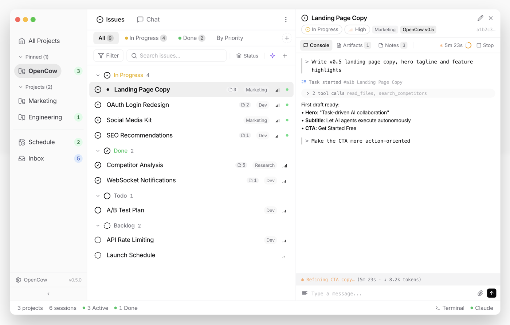

<div align="center">

<p align="right">
  <a href="README.md">English</a> · <strong>简体中文</strong>
</p>


# OpenCow

### 一个任务，一个 Agent，交付即闭环。

面向任务驱动的开源自主 AI 平台。<br/>
每个任务自动变成独立 Agent — 方案、报告、功能、审计<br/>
并行交付。适用于每个团队。

[](LICENSE)
[](https://www.electronjs.org/)
[](https://react.dev/)
[](https://www.typescriptlang.org/)
[](CONTRIBUTING.md)

[工作原理](#工作原理) · [功能特性](#功能特性) · [快速开始](#快速开始) · [架构](#架构) · [参与贡献](#参与贡献)

**[官方网站](https://opencow.ai)** · **[X (Twitter)](https://x.com/OpenCow_AI)** · **[下载](https://opencow.ai/download)**

</div>

---

<div align="center">

</div>

## 工作原理

### 任务进，结果出。

| 步骤 | 发生了什么 |
|:----:|:-------------|
| **创建** | 写一个任务，而不是一段 prompt。描述交付物 — 方案、报告、功能、审计。OpenCow 自动关联完整上下文：项目文件、历史记录、关联任务。 |
| **派发** | 一个任务，一个 Agent。每个任务获得一个独立的 Agent，拥有完整上下文 — 项目知识、团队规范、组织标准。15 个任务，15 个 Agent，并行执行。 |
| **交付** | Agent 自主研究、起草、构建和发布。实时进度、即时通知、每一步都有审批门控。审阅。发布。 |

---

## 功能特性

满足将任务清单变为并行 AI 劳动力的一切所需。

<table>
<tr>
<td width="50%">

### 任务→Agent 流水线
内置任务追踪器，每个任务自动成为一个 Agent。将项目拆分为子任务，每个子任务对应一个专属 Agent。你的任务清单就是你的交付计划。

`1 个任务 = 1 个 Agent` · `子任务层级` · `自动关联上下文`

</td>
<td width="50%">

### Agent 智能体
为 Agent 装备你组织的知识、标准和工具。技能、工作手册、集成 — 每个 Agent 都遵循你的流程。

`自定义技能` · `6 种能力类型` · `自动同步标准`

</td>
</tr>
<tr>
<td>

### Agent 指挥中心
实时仪表盘。追踪每个 Agent 的进度和操作。审批交付物。一个界面，全局掌控。

`实时监控` · `任务关联状态` · `审批门控`

</td>
<td>

### 随时随地工作
通过 Telegram、Discord、微信或飞书派发 Agent。设置定期自动化工作流。通过 Webhook 接收通知。

`4 个 IM 平台` · `自然语言` · `7 种调度类型`

</td>
</tr>
</table>

---

## 一切内置

无需插件，无需额外配置集成。AI 团队所需的一切能力。

<table>
<tr>
<td width="25%" align="center">

**任务与 Agent 核心**
<br/><sub>任务追踪器 · Agent 仪表盘<br/>实时监控 · 多项目管理</sub>

</td>
<td width="25%" align="center">

**智能体系**
<br/><sub>智能中心 · 技能市场<br/>内置浏览器 · 产物管理</sub>

</td>
<td width="25%" align="center">

**自动化**
<br/><sub>定时调度 · Webhook<br/>通知 · 实时预览</sub>

</td>
<td width="25%" align="center">

**命令与控制**
<br/><sub>IM 指令 · 终端<br/>命令面板 · 主题</sub>

</td>
</tr>
</table>

---

## 设计理念

定义 OpenCow 的核心设计决策。

| | 原则 | 含义 |
|:---:|:----------|:-------------|
| **1:1** | 任务 &rarr; Agent | 一个任务，一个 Agent。完整上下文、完整追溯、零歧义。 |
| ✅ | 本地 & 隐私 | 一切运行在你的本地机器上。零遥测、零云端。你的数据永远不会离开。 |
| **15+** | 并行 Agent | 同时交付 15+ 个任务。挂起和恢复任何 Agent 而不丢失上下文。 |
| **4 层** | 深度上下文引擎 | 每个 Agent 继承组织知识、项目上下文、团队标准和任务专属指令。 |

---

## 快速开始

### 从源码构建（面向贡献者）

**前置条件：** [Node.js](https://nodejs.org/) >= 18 以及 [pnpm](https://pnpm.io/) >= 9

```bash
# 克隆仓库
git clone https://github.com/OpenCowAI/opencow.git
cd opencow

# 安装依赖
pnpm install

# 以开发模式启动（支持 HMR 热更新）
pnpm dev
```

### 下载应用

从 [opencow.ai/download](https://opencow.ai/download) 获取最新版 — 免费、开源，60 秒就绪。

---

## 技术栈

| 层级 | 技术选型 | 理由 |
|-------|--------|-----|
| **桌面端** | Electron 40 | 跨平台、原生级体验 |
| **界面** | React 19 + Tailwind CSS 4 | 并发渲染、原子化 CSS |
| **语言** | TypeScript（strict，零 `any`） | 端到端类型安全 |
| **状态** | Zustand | 轻量响应式 Store，支持行级订阅 |
| **构建** | electron-vite (Vite) | 亚秒级 HMR，三目标构建 |
| **数据库** | SQLite via Kysely | 本地优先、类型安全的 Schema，35+ 次迁移 |
| **终端** | xterm.js + WebGL | 硬件加速终端渲染 |
| **编辑器** | Monaco Editor | VS Code 级别的编辑体验 |
| **测试** | Vitest + React Testing Library | 快速、现代的测试运行器 |
| **AI** | Claude Agent SDK + Codex SDK + MCP | 多引擎 — 可选 Claude 或 Codex 作为 AI 引擎，支持 Model Context Protocol |

---

## 架构

OpenCow 采用强化的 Electron 架构，严格的进程隔离：

```
┌─────────────────────────────────────────────────────┐
│                   渲染进程 (Renderer)                  │
│  ┌───────────┐  ┌──────────┐  ┌──────────────────┐  │
│  │  React 19  │  │  Zustand  │  │  271 个组件      │  │
│  │  组件      │  │  Store    │  │  68 个 Hook      │  │
│  └─────┬─────┘  └────┬─────┘  └────────┬─────────┘  │
│        └──────────────┴─────────────────┘            │
│                        │ IPC (contextBridge)         │
├────────────────────────┼────────────────────────────┤
│                   主进程 (Main)                       │
│  ┌──────────┐  ┌──────────┐  ┌───────────────────┐  │
│  │  DataBus  │  │  服务层   │  │  原生模块          │  │
│  │  事件总线  │  │  (47+)   │  │  SQLite · PTY     │  │
│  └──────────┘  └──────────┘  └───────────────────┘  │
│  ┌──────────┐  ┌──────────┐  ┌───────────────────┐  │
│  │  Claude   │  │  Bot     │  │  能力中心          │  │
│  │  Agent SDK│  │  网关     │  │  Capability Center │  │
│  └──────────┘  └──────────┘  └───────────────────┘  │
└─────────────────────────────────────────────────────┘
```

**安全模型：**
- `contextIsolation: true` — 渲染进程无法访问 Node.js
- `nodeIntegration: false` — 禁止直接加载模块
- 通过 `contextBridge.exposeInMainWorld` 实现类型安全的 IPC 桥接
- 沙箱化文件访问，显式路径白名单
- 开发环境 (`~/.opencow-dev`) 和生产环境 (`~/.opencow`) 使用独立数据目录

---

## 项目结构

```
opencow/
├── electron/                  # 主进程
│   ├── main.ts               # 应用入口
│   ├── preload.ts            # 安全 IPC 桥接
│   ├── services/             # 47+ 后端服务模块
│   │   ├── capabilityCenter/ # AI 能力管理
│   │   ├── schedule/         # 定时自动化引擎
│   │   ├── messaging/        # 多渠道消息
│   │   ├── git/              # Git 集成层
│   │   └── ...
│   ├── database/             # SQLite Schema 与迁移
│   ├── sources/              # Hook、任务和统计数据源
│   └── ipc/                  # IPC 通道处理器
├── src/
│   ├── renderer/             # React 应用
│   │   ├── components/       # 32 个功能模块，271 个组件
│   │   ├── hooks/            # 68 个自定义 React Hook
│   │   ├── stores/           # 18 个 Zustand 领域 Store
│   │   ├── lib/              # 工具函数与辅助库
│   │   └── locales/          # 国际化 (en-US, zh-CN)
│   └── shared/               # 跨进程共享类型与工具
├── tests/                    # Vitest 测试套件
├── docs/                     # 520+ 设计文档与提案
└── resources/                # 应用图标与托盘资源
```

---

## 开发

### 常用脚本

| 命令 | 功能 |
|---------|-------------|
| `pnpm dev` | 启动开发模式（支持 HMR） |
| `pnpm build` | 编译所有目标 |
| `pnpm preview` | 构建并以生产模式启动 |
| `pnpm package` | 构建并打包 `.app`（快速，用于测试） |
| `pnpm package:dmg` | 构建并打包 `.dmg` 安装包 |
| `pnpm typecheck` | TypeScript 严格类型检查 |
| `pnpm lint` | ESLint 代码检查 |
| `pnpm format` | Prettier 格式化 |
| `pnpm test` | 运行所有测试 |
| `pnpm test:watch` | 测试监听模式 |

### 构建目标

electron-vite 编译三个独立的 TypeScript 目标：

| 目标 | 入口 | 输出 |
|--------|-------|--------|
| Main | `electron/main.ts` | `out/main/` |
| Preload | `electron/preload.ts` | `out/preload/` |
| Renderer | `src/renderer/index.html` | `out/renderer/` |

### 路径别名

- `@` &rarr; `src/renderer`（仅渲染进程）
- `@shared` &rarr; `src/shared`（所有目标）

### 代码规范

- **TypeScript** 严格模式，零 `any` 使用
- **Prettier** — 无分号、单引号、100 字符行宽、2 空格缩进
- **ESLint** — 严格规则，含 React Hooks 插件
- **约定式提交** — `feat:`、`fix:`、`perf:`、`refactor:` 等

---

## 打包

```bash
# macOS .app（本地测试，快速）
pnpm package
# 输出：dist/mac-arm64/OpenCow.app

# macOS .dmg（用于分发）
pnpm package:dmg
# 输出：dist/OpenCow-{version}.dmg
```

通过 `package.json` 中的 electron-builder 配置，支持 Windows 和 Linux 的跨平台构建。

---

## 参与贡献

我们欢迎各种形式的贡献 — Bug 修复、新功能、文档和想法。

```bash
# 1. Fork 并克隆
git clone https://github.com/<you>/opencow.git
cd opencow

# 2. 安装并运行
pnpm install && pnpm dev

# 3. 创建分支、修改代码、提交 PR
git checkout -b feat/my-feature
```

请阅读 **[CONTRIBUTING.md](CONTRIBUTING.md)** 获取完整的代码风格、提交格式和审阅流程指南。

---

## 社区

- [X (Twitter)](https://x.com/OpenCow_AI) — 关注我们获取最新动态
- [Discord](https://discord.gg/dDsjwb5pzN) — 加入社区交流
- [GitHub Issues](https://github.com/OpenCowAI/opencow/issues) — Bug 报告与功能请求
- [GitHub Discussions](https://github.com/OpenCowAI/opencow/discussions) — 问题与想法
- [行为准则](CODE_OF_CONDUCT.md) — 社区行为规范

---

## Star 趋势

<div align="center">

<a href="https://www.star-history.com/?repos=OpenCowAI%2Fopencow&type=date&legend=top-left"> <picture>   <source media="(prefers-color-scheme: dark)" srcset="https://api.star-history.com/image?repos=OpenCowAI/opencow&type=date&theme=dark&legend=top-left" />   <source media="(prefers-color-scheme: light)" srcset="https://api.star-history.com/image?repos=OpenCowAI/opencow&type=date&legend=top-left" />    </picture></a>

</div>

---

## 许可证

[Apache-2.0](LICENSE) — 完全免费且开源。无付费层级、无使用限制、无订阅。

> **第三方 SDK：** OpenCow 集成了第三方 AI SDK（如 `@anthropic-ai/claude-agent-sdk`、`@openai/codex-sdk`），它们各自受其许可条款约束。请在使用前查阅各 SDK 的许可证。

<div align="center">
<br />
<sub>为每个团队打造的自主 Agent。</sub>
</div>
